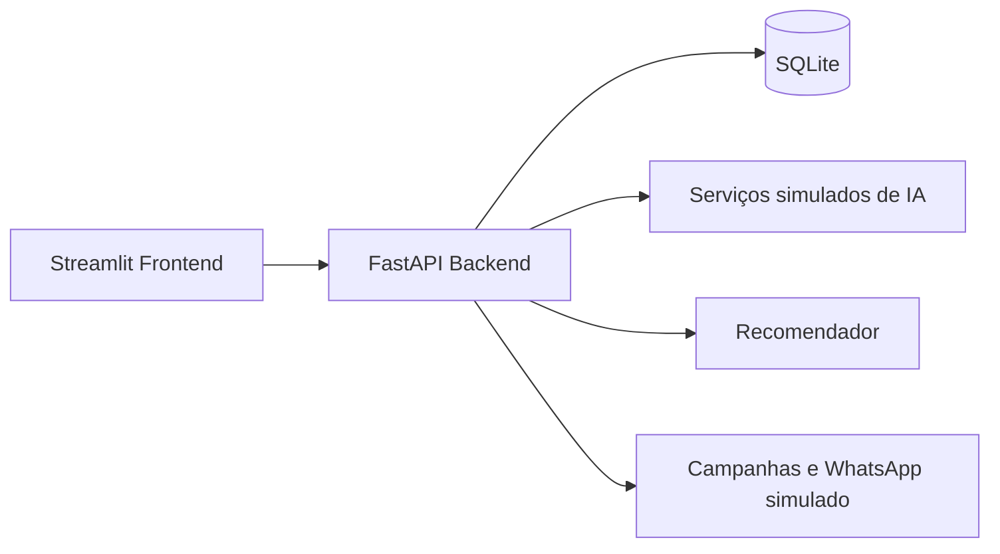

<div align="center">


</div>


<div align="center">

[](https://www.python.org/)
[](https://fastapi.tiangolo.com/)
[](https://streamlit.io/)

**Plataforma para centralizar agenda, clientes, serviços, campanhas e atendimento inteligente em negócios de beleza.**

</div>

## Sobre o projeto

O **BeautyFlow AI** é um protótipo full stack para salões, clínicas de estética e profissionais autônomos. A aplicação combina gestão operacional, indicadores, atendimento simulado com IA e campanhas em uma experiência visual inspirada em SaaS de beleza.

A proposta é transformar conversas e rotinas manuais em ações organizadas: cadastro de clientes, agenda, serviços, recomendações, campanhas e simulação de WhatsApp.

## Funcionalidades

- Login demo com autenticação local
- Home com visão geral do produto
- Dashboard com clientes, agenda, receita, ticket médio e serviços mais usados
- Cadastro, busca, edição e exclusão segura de clientes
- Cadastro, edição e desativação de serviços
- Agenda com criação de agendamentos e atualização de status
- Assistente IA para respostas, mensagens e posts de campanha
- Recomendador de serviços por perfil da cliente
- Atendimento IA com detecção de intenção no estilo WhatsApp
- Campanhas com simulação de envio para público-alvo
- API FastAPI documentada automaticamente

## Tecnologias

- Python
- FastAPI
- Streamlit
- SQLite
- SQLModel
- Pandas
- Requests
- Pytest
- HTTPX

## Arquitetura



## Como executar localmente

Crie e ative o ambiente virtual:

```bash
python -m venv .venv
```

No Windows:

```bash
.venv\Scripts\activate
```

No Linux/macOS:

```bash
source .venv/bin/activate
```

Instale as dependências e crie os dados iniciais:

```bash
pip install -r requirements.txt
python seed.py
```

Rode o backend:

```bash
python -m uvicorn app.main:app --reload
```

Em outro terminal, rode o frontend:

```bash
python -m streamlit run frontend/streamlit_app.py
```

Acesse:

```text
Frontend: http://localhost:8501
API Docs: http://127.0.0.1:8000/docs
```

## Login demo

```text
E-mail: geovanna@beautyflow.ai
Senha: 123456
```

## Endpoints principais

```text
GET  /api/health
GET  /api/dashboard
GET  /api/clients
POST /api/clients
PUT  /api/clients/{client_id}
DELETE /api/clients/{client_id}

GET  /api/services
POST /api/services
PUT  /api/services/{service_id}
DELETE /api/services/{service_id}

GET  /api/professionals
POST /api/professionals

GET  /api/appointments
POST /api/appointments
PATCH /api/appointments/{appointment_id}/status

POST /api/recommendations
POST /api/ai/chat
POST /api/ai/message
POST /api/ai/marketing-post
POST /api/whatsapp/simulate

GET  /api/campaigns
POST /api/campaigns
POST /api/campaigns/{campaign_id}/simulate-send
GET  /api/scheduled-messages
```

## Estrutura

```text
app/             Backend, API, banco, serviços e recomendador
frontend/        Interface Streamlit
data/            Dados demonstrativos
knowledge_base/  Base textual de apoio
docs/            Documentação
assets/          Imagens e recursos do README
tests/           Testes automatizados
```

## Testes

```bash
python -m compileall app frontend
pytest
```

## Roadmap

- Publicação em cloud
- Integração real com API de WhatsApp
- Autenticação real por usuário
- Banco em nuvem
- Histórico avançado de conversas
- Dashboard com gráficos adicionais

## Status

Projeto em evolução, com backend FastAPI, frontend Streamlit, dados demonstrativos, campanhas, agenda e atendimento IA simulado funcionais para apresentação e testes locais.

## Autoria

Desenvolvido por **[Geovanna Eduarda da Silva](https://github.com/geovannasilva15)**.
