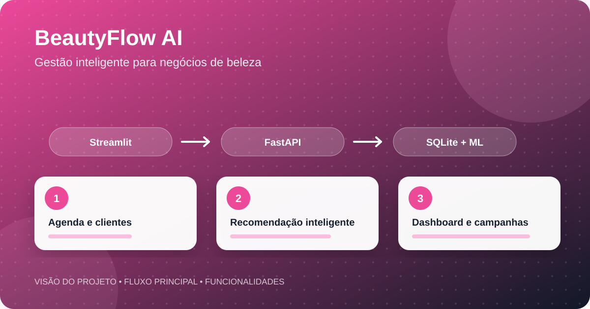
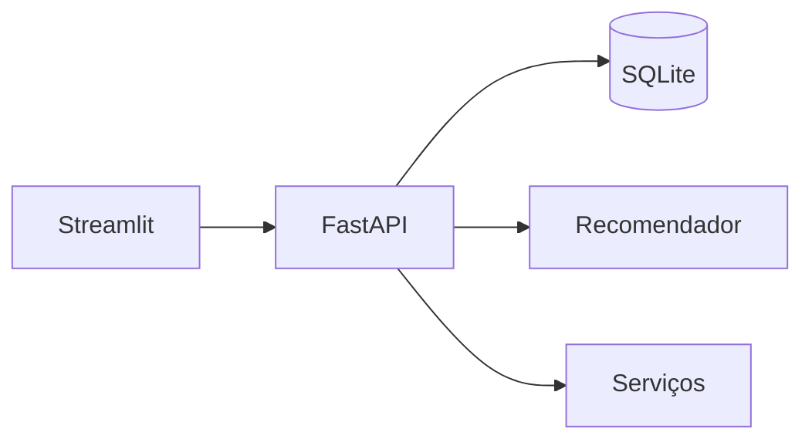

<div align="center">


</div>




<div align="center">

[](https://www.python.org/)
[](https://fastapi.tiangolo.com/)
[](https://streamlit.io/)

**Plataforma para centralizar agenda, clientes, serviços, campanhas e atendimento inteligente em negócios de beleza.**

</div>

## Sobre o projeto

O BeautyFlow AI é um protótipo full stack voltado a salões, clínicas de estética e profissionais autônomos. A aplicação combina gestão operacional, indicadores e recursos inteligentes em uma experiência integrada.

## Principais funcionalidades

- Dashboard executivo com indicadores do negócio
- Cadastro e gestão de clientes e serviços
- Agenda de atendimentos
- Assistente e recomendador de serviços
- Simulação de atendimento pelo WhatsApp
- Campanhas e mensagens programadas
- API documentada automaticamente

## Arquitetura



## Tecnologias

Python, FastAPI, Streamlit, SQLModel, SQLite, Pandas, Requests, Pytest e HTTPX.

## Executar localmente

```bash
python -m venv .venv
# Windows: .venv\Scripts\activate
# Linux/macOS: source .venv/bin/activate
pip install -r requirements.txt
python seed.py
python -m uvicorn app.main:app --reload
```

Em outro terminal:

```bash
python -m streamlit run frontend/streamlit_app.py
```

Acesse a interface em `http://localhost:8501` e a documentação da API em `http://127.0.0.1:8000/docs`.

<details><summary>Credenciais demonstrativas</summary>

```text
E-mail: geovanna@beautyflow.ai
Senha: 123456
```

</details>

## Estrutura

```text
app/             Backend e regras de negócio
frontend/        Interface Streamlit
data/            Dados demonstrativos
knowledge_base/  Base textual
docs/            Documentação
tests/           Testes
```

## Autoria

Desenvolvido por **[Geovanna Eduarda da Silva](https://github.com/geovannasilva15)**.
